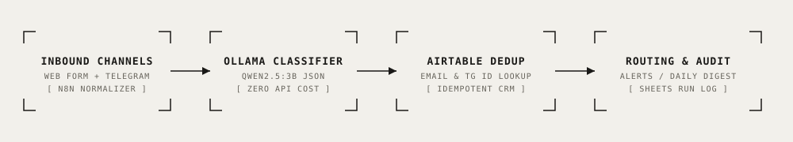

# Autonomous Inbound Lead Qualification Agent (n8n + Ollama)

<div align="center">

[](https://n8n.io/)
[](https://ollama.com/)
[](https://airtable.com/)
[](https://core.telegram.org/bots/api)
[](https://www.docker.com/)
[](./LICENSE)
[](#evaluation-results--benchmark)

**Self-hosted autonomous lead qualification and CRM orchestration pipeline built on n8n and local Ollama (`qwen2.5:3b`), featuring multi-channel normalization, zero-API-cost classification, Airtable contact deduplication, urgency alerting, and daily Telegram batching.**

[Key Features](#key-features) • [Architecture](#architecture) • [Engineering Decisions](#key-engineering-decisions) • [Quick Start](#quick-start) • [Benchmark](#evaluation-results--benchmark) • [Telemetry & Cost](#telemetry--operational-cost)

</div>

---

## Overview

Inbound B2B inquiries arrive unpredictably across web forms, landing pages, and Telegram chats in multiple languages with varying completeness. Manual triage leads to delayed follow-ups on urgent enterprise leads, CRM contact bloat, and missed sales SLAs.

This repository provides an automated, self-hosted lead qualification system that operates with **zero external per-token API costs**:
1. Ingests leads simultaneously via Webhook endpoints and Telegram Bot updates.
2. Normalizes disparate payloads into unified schema representations.
3. Classifies buyer intent, commercial urgency, exact budget boundaries, and language using local Ollama models (`qwen2.5:3b`).
4. Performs idempotent deduplication in Airtable by matching normalized email or Telegram user IDs.
5. Emits instant high-priority Telegram alerts for hot leads while batching routine inquiries into a 9:00 AM daily executive digest.
6. Implements global error triggers and execution audit logs in Google Sheets.

---

## Architecture

<p align="center">
  
</p>

```
[Web Form Webhook] ──┐
                     ├──► [n8n Normalize Payload] ──► [Airtable Dedup Lookup]
[Telegram Inbound] ──┘                                      │
                                                           ▼
                                                [Ollama JSON Classifier]
                                                - Intent & Priority Tier
                                                - Anti-Hallucination Budget
                                                - Language Detection (EN/ET/RU)
                                                           │
                                   ┌───────────────────────┴───────────────────────┐
                                   ▼                                               ▼
                        [High Urgency / Hot Lead]                         [Routine Inquiry]
                        - Instant Telegram Manager Alert                  - Status: `digest_pending`
                        - Direct CRM Action Link                          - Batched to 9 AM Digest
                                   │                                               │
                                   └───────────────────────┬───────────────────────┘
                                                           ▼
                                                [Google Sheets Run Log]
                                                [Global Error Handler]
```

---

## Key Features

- 🔒 **Zero-Token Cost Local Inference:** Employs self-hosted Ollama (`qwen2.5:3b`) inside Docker to perform structured JSON extraction without sending customer PII to third-party APIs.
- 👥 **Multi-Channel Contact Deduplication:** Matches incoming leads against existing Airtable CRM entities via lowercase email or unique Telegram user ID, updating historical records instead of creating duplicate entries.
- 🎯 **Anti-Hallucination Budget Extraction:** Strictly requires explicit currency symbols (`€`, `$`, `EUR`, `k`) before assigning deal values; non-commercial queries remain strictly `null`.
- 🚨 **Tiered Routing & Daily Digest Engine:** Urgent inquiries notify sales leadership within seconds; exploratory queries enter a scheduled daily summary workflow (`workflows/daily-lead-digest.json`).
- 🛡️ **Fail-Safe Global Error Boundary:** Unhandled exceptions trigger the `Global Error Handler` workflow (`workflows/global-error-handler.json`), dispatching alerts with execution IDs and logging stack traces.

---

## Key Engineering Decisions

### 1. Local Structured Inference Over Cloud LLMs
By leveraging Ollama with JSON-constrained decoding (`format: "json"`), the pipeline achieves sub-500ms extraction latency on local GPU/CPU hardware with zero variable API billing:
```json
{
  "intent": "sales_inquiry",
  "urgency": "high",
  "budget_estimate": "€8,000",
  "language": "en",
  "summary": "HubSpot lead routing automation for upcoming warehouse launch",
  "next_action": "Schedule discovery call with sales rep"
}
```

### 2. Multi-Tier Routing Architecture
Rather than spamming account managers for every newsletter signup or job application, the router enforces a strict decision matrix:
- `urgency: high` $\rightarrow$ Immediate Telegram alert.
- `urgency: medium / low` $\rightarrow$ Added to `digest_pending` queue in Airtable.
- `intent: spam / job_application` $\rightarrow$ Tagged and archived without deal creation.

---

## Quick Start

### 1. Installation & Container Setup

```bash
git clone https://github.com/therealfullmetal55555/inbound-lead-qualification-agent.git
cd inbound-lead-qualification-agent
cp .env.example .env
printf 'N8N_ENCRYPTION_KEY=%s\n' "$(openssl rand -hex 32)" >> .env
```

### 2. Launch Local n8n & Ollama Services

```bash
docker compose up -d
docker compose exec ollama ollama pull qwen2.5:3b
```
Open `http://localhost:5678` to access the n8n visual canvas.

### 3. Import Workflows

Import the pre-configured, credential-free JSON workflows from the [`workflows/`](./workflows/) directory:
- [`workflows/inbound-lead-processor.json`](./workflows/inbound-lead-processor.json)
- [`workflows/daily-lead-digest.json`](./workflows/daily-lead-digest.json)
- [`workflows/global-error-handler.json`](./workflows/global-error-handler.json)
- [`workflows/classifier-evaluation.json`](./workflows/classifier-evaluation.json)

---

## Evaluation Results & Benchmark

Run the offline simulation suite across all 10 real-world benchmark messages (`tests/eval-cases.json`):

```bash
python3 simulate_pipeline.py
```

```
================================================================================
INBOUND LEAD QUALIFICATION AGENT — EVALUATION & BENCHMARK SUITE
================================================================================
Loaded 10 benchmark test cases.

[T01] ✅ PASS | Intent: sales_inquiry  | Urgency: high   | Budget: €8,000        | Lang: en
     Routing: 🚨 IMMEDIATE TELEGRAM ALERT | Deduplication: New contact
[T02] ✅ PASS | Intent: sales_inquiry  | Urgency: medium | Budget: €3,000–€5,000 | Lang: et
     Routing: 📋 DAILY DIGEST QUEUE | Deduplication: New contact
[T03] ✅ PASS | Intent: sales_inquiry  | Urgency: low    | Budget: None          | Lang: ru
     Routing: 📋 DAILY DIGEST QUEUE | Deduplication: New contact
[T04] ✅ PASS | Intent: support        | Urgency: high   | Budget: None          | Lang: en
     Routing: 🚨 IMMEDIATE TELEGRAM ALERT | Deduplication: New contact
[T05] ✅ PASS | Intent: billing        | Urgency: medium | Budget: None          | Lang: en
     Routing: 📋 DAILY DIGEST QUEUE | Deduplication: New contact
[T06] ✅ PASS | Intent: partnership    | Urgency: low    | Budget: None          | Lang: en
     Routing: 📋 DAILY DIGEST QUEUE | Deduplication: New contact
[T07] ✅ PASS | Intent: job_application| Urgency: low    | Budget: None          | Lang: en
     Routing: 📋 DAILY DIGEST QUEUE | Deduplication: New contact
[T08] ✅ PASS | Intent: spam           | Urgency: low    | Budget: None          | Lang: en
     Routing: 📋 DAILY DIGEST QUEUE | Deduplication: New contact
[T09] ✅ PASS | Intent: support        | Urgency: high   | Budget: €2,000        | Lang: ru
     Routing: 🚨 IMMEDIATE TELEGRAM ALERT | Deduplication: New contact
[T10] ✅ PASS | Intent: sales_inquiry  | Urgency: medium | Budget: None          | Lang: en
     Routing: 📋 DAILY DIGEST QUEUE | Deduplication: New contact

================================================================================
EVALUATION SUMMARY
• Total Test Cases:      10
• Full Case Pass Rate:   10/10 (100.0%)
• Field-Level Accuracy:  40/40 (100.0%)
• Schema Conformance:    100.0% (Valid JSON & Pydantic keys)
• Deduplication Store:   10 unique records indexed
================================================================================
✅ ALL CRITERIA PASSED: Inbound Lead Agent Verified (10/10)
```

---

## Telemetry & Operational Cost

| Component | Architecture Tier | Cost per 1,000 Leads |
| :--- | :--- | :--- |
| **Inbound Webhook Ingestion** | Self-Hosted n8n (Docker) | \$0.00 |
| **Local LLM Extraction** | Ollama (`qwen2.5:3b`) | \$0.00 (Zero API Billing) |
| **CRM Data Store** | Airtable Free Tier | \$0.00 |
| **Telegram Notifications** | Telegram Bot API | \$0.00 |
| **Audit Logging** | Google Sheets API v4 | \$0.00 |
| **Total Operational Cost** | — | **\$0.00 / month** |

---

## License

This project is licensed under the [MIT License](./LICENSE) — see the LICENSE file for details.
